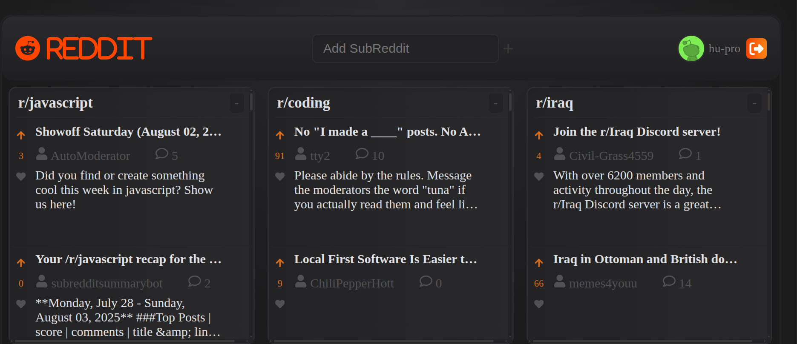

# subReddit-posts

A full-stack web app that fetches and displays Reddit posts using the Reddit API. Users can authenticate via Reddit, save subreddit feeds (lanes), and access them across sessions.

## 🖼️ Preview

## 🌐 Live Demo

Access the app at: [subRedditPosts](http://subredditposts.duckdns.org)

---

## 📌 Features

- 🔐 Reddit OAuth login
- 🗂️ Display posts in **lanes** (one per subreddit)
- 💾 Saved lanes per user (stored in MongoDB Atlas)
- 🔁 Auto-delete expired Reddit tokens from the database
- 🍪 JWT authentication via HTTP-only cookies
- 🚀 Deployment with GitHub Actions on AWS EC2 using Nginx

---

## 🛠️ Tech Stack

### Frontend
- [React](https://reactjs.org/)
- [Vite](https://vitejs.dev/) 

### Backend
- [ASP.NET Core](https://dotnet.microsoft.com/)
- Reddit OAuth API
- MongoDB Atlas (NoSQL database)
- JWT for authentication

### DevOps / Hosting
- GitHub Actions (CI/CD)
- AWS EC2 (Ubuntu)
- Nginx (Reverse Proxy)
- DuckDNS (Free domain)

---

## 📦 Project Structure

